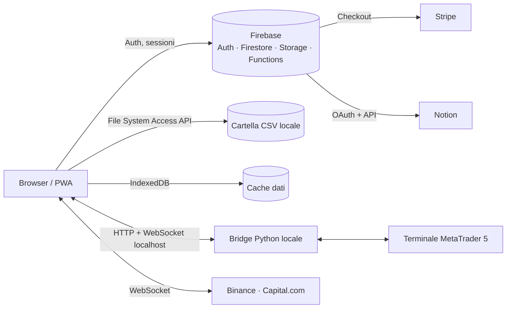

# Forex Backtest Lab

Web app per il **backtesting manuale di strategie di trading**: riproduce i dati storici candela per candela direttamente nel browser, permette di aprire e gestire operazioni simulate e, quando serve, di passare all'esecuzione reale tramite MetaTrader 5.

> Progetto personale sviluppato da [Pietro Santini](https://www.linkedin.com/in/pietro-santini-2766aa277/), in fase di pre-lancio.

> **Riprendi il lavoro da qui.** Chi subentra — persona o agente AI — legga per primo
> [`cervello/CONSEGNA.md`](cervello/CONSEGNA.md): che cos'e' il sistema, a cosa e' collegato
> (server, Firebase, pagamenti, mercati), che cosa e' stato fatto, che cosa manca e con che
> regole si lavora. Il resto della memoria del progetto sta in [`cervello/`](cervello/).

<!-- Aggiungere qui 2-3 screenshot: replay del grafico, pannello ordini, Prop Firm Mode -->

---

## Funzionalità principali

| Area | Cosa fa |
|---|---|
| **Replay storico** | Riproduce i dati OHLC candela per candela con velocità regolabile (0,5x – 10x), su grafici disegnati con Canvas. |
| **Libreria dati CSV** | Collega una cartella locale del PC (File System Access API), riconosce i file CSV (es. HistData, formato MetaTrader M1), li organizza per strumento e li mette in cache con IndexedDB. |
| **Gestione ordini simulata** | Buy/Sell con Stop Loss e Take Profit impostati sul grafico, P/L e capitale aggiornati in tempo reale. |
| **Prop Firm Mode** | Simula le regole delle società di prop trading: perdita massima giornaliera, drawdown complessivo, obiettivo di profitto. |
| **Sessioni sincronizzate** | Lo stato della sessione (capitale, posizioni, storico) viene salvato su Firestore e si riprende da un altro dispositivo. |
| **Bridge MetaTrader 5** | Un servizio Python locale espone API HTTP e WebSocket: l'app invia ordini al terminale MT5 e riceve tick e book in tempo reale, senza che le credenziali del broker lascino il PC. |
| **Dati live** | Flussi WebSocket da Binance e Capital.com per la modalità live. |
| **Diario su Notion** | Tramite le API di Notion, ogni operazione chiusa viene scritta in un database del diario, senza duplicati. |
| **Indicatori personalizzati con AI** | Genera un prompt per convertire un indicatore (es. da PineScript) in JavaScript con un assistente AI, poi valida e integra il codice ottenuto. |
| **PWA** | Installabile su desktop e mobile (manifest + service worker). |

---

## Architettura



- **Frontend:** HTML, CSS e JavaScript (vanilla, nessun framework), grafici su Canvas.
- **Backend:** Firebase Authentication, Cloud Firestore, Cloud Storage, Cloud Functions (checkout Stripe, integrazione Notion).
- **Pagamenti:** Stripe Checkout.
- **Integrazioni locali:** bridge Python per MetaTrader 5 (repository separato, non pubblico).
- **Hosting:** GitHub Pages.

---

## Struttura del repository

```
├── index.html             Landing page
├── login.html             Accesso e registrazione (Firebase Auth)
├── app.html               Applicazione: replay, ordini, bridge MT5, Notion
├── asset-library.html     Gestione della libreria di dati storici CSV
├── sw.js                  Service worker (PWA)
├── manifest.json          Manifest PWA
├── cors.json              Configurazione CORS per Cloud Storage
├── privacy.html, termini.html, rischi-finanziari.html, informativa-bot.html
└── icone (icon-192.png, icon-512.png, apple-touch-icon.png)
```

---

## Avvio in locale

```bash
git clone https://github.com/Pietro-Santini/Forex-Backtest.LAB.git
cd Forex-Backtest.LAB
python -m http.server 8000
# aprire http://localhost:8000/app.html in Chrome o Edge
```

La File System Access API richiede Chrome o Edge su desktop. Le funzioni cloud (login, sincronizzazione, pagamenti) richiedono un progetto Firebase configurato. Il bridge MT5 richiede Windows con il terminale MetaTrader 5 installato.

---

## Limiti noti e prossimi passi

- **Struttura del codice:** gran parte della logica è oggi in `app.html`. Il prossimo passo è separare il JavaScript in moduli ES (grafico, ordini, bridge, sync, Notion).
- **Test automatici:** da introdurre sui calcoli di P/L e sulle regole della Prop Firm Mode.
- **Dati storici:** l'utente deve procurarsi i file CSV (es. da HistData); non c'è un feed storico integrato.
- **Piattaforma:** il bridge MT5 funziona solo su Windows.

---

## Sviluppo con AI

Il progetto è stato sviluppato usando assistenti AI (Claude, ChatGPT) come strumento di lavoro: per generare e rivedere codice, fare debug e scrivere documentazione. Progettazione, integrazione tra i componenti, test e scelte architetturali sono state seguite personalmente.

---

## Avvertenza

Il software è uno strumento di simulazione e analisi e non costituisce consulenza finanziaria. Il trading comporta un rischio elevato di perdita del capitale. Vedi [rischi-finanziari.html](rischi-finanziari.html).

© 2026 Pietro Santini. Tutti i diritti riservati.

